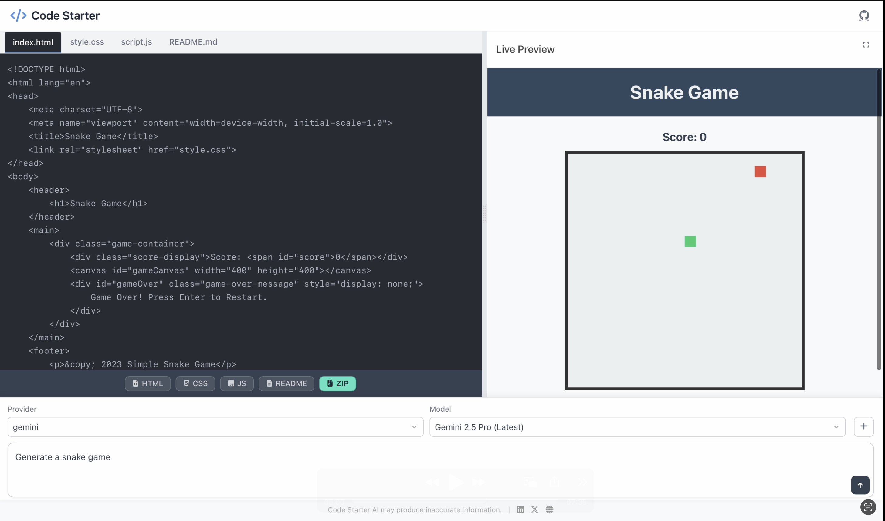

# Code Starter AI

Generate starter web code (HTML/CSS/JS) from natural language prompts using various AI models, and learn how to integrate multiple AI providers.



---

## Features

*   **AI-Powered Code Generation:** Describe the website or component you want, and get initial HTML, CSS, and JavaScript code.
*   **Multiple AI Provider Support:** Easily select and use models from different providers (e.g., OpenAI, Google Gemini, DeepSeek - *configurable via backend*).
*   **Live Preview:** See your generated code rendered instantly in an iframe.
*   **Integrated Code Editors:** View and tweak the generated HTML, CSS, and JS in separate tabs.
*   **README Generation:** Creates a basic README.md file for the generated project.
*   **Download Options:** Download individual files (HTML, CSS, JS, README) or the entire project as a ZIP archive.
*   **Integration Example:** The codebase serves as a practical example of how to structure calls to various AI provider APIs from a JavaScript application.

---

## Frontend Live Demo


---

## How it Works (High Level)

1.  The **Frontend** (Vanilla JS, HTML, CSS) captures the user's prompt and selected AI provider/model.
2.  It sends this information to the **Backend** API (e.g., Node.js/Express - *specify your backend if different*).
3.  The Backend validates the request and forwards the prompt to the chosen **AI Provider's API**.
4.  The AI generates the code components (HTML, CSS, JS).
5.  The Backend sends the generated code back to the Frontend.
6.  The Frontend displays the code in editors and updates the live preview iframe.

---

## Getting Started (Local Development)

To run this project locally:

1.  **Clone the repository:**
    ```bash
    git clone https://github.com/abderrahimFizazi/ai_code_starter && cd ai_code_starter
    ```

2.  **Install dependencies:**
    *   **Frontend:** No build step usually needed for vanilla JS, but if you add one: `cd public && npm install` 
    *   **Backend:** Navigate to your backend directory (if separate) and run:
        ```bash
        npm install
        ```

3.  **Configure Environment Variables:**
    *   Create a `.env` file in the root file
    *   Add the necessary API keys for the AI providers you want to use. See the **Configuration** section below.
    *   **Important:** Never commit your `.env` file to version control! Add `.env` to your `.gitignore` file.

4.  **Run the application:**
    *   Start the backend server (from the backend directory):
        ```bash
        npm start
        ```
    *   Start the application:
        ```bash
        node server.js
        ```
    *  **Important:**  Make sure to kill process in PORT 3000 using command like:
        ```bash
        kill -9 $(lsof -ti:3000)
        ```

5.  Access the application from browser: `http://localhost:3000`

---

## Configuration (`.env` file)

Create a `.env` file in the root directory and add the following variables, providing keys for the services you intend to use:

```dotenv
# Example .env configuration
# Add keys ONLY for the providers you have configured in the backend

# OpenAI
OPENAI_API_KEY=sk-xxxxxxxxxxxxxxxxxxxxxxxxxxxxxxxxxxxxxxxx

# Google Gemini
GEMINI_API_KEY=AIzaSyxxxxxxxxxxxxxxxxxxxxxxxxxxxxxxx

# DeepSeek (or other providers if needed)
# Follow the specific provider's key naming/requirements
DEEPSEEK_API_KEY=ds-xxxxxxxxxxxxxxxxxxxxxxxxxxxxxxxxxxxxxxxx